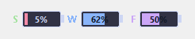

# Claude Usage Widget 사용설명서

## 1. 소개

내 Claude 사용량(5시간 세션 · 주간 한도 · 모델별 주간 한도)을 바탕화면 한구석에 항상 띄워 두는 작은 Windows 위젯입니다.


`claude.ai/settings/usage` 화면과 **같은 수치**를 보여 주며, 사이트에 들어가지 않아도 지금 얼마나 썼는지 바로 확인할 수 있습니다. 라이트/다크 테마를 모두 지원합니다.

| 라이트 | 다크 |
|---|---|
|  |  |

---

## 2. 설치

### 전제조건 (공통)

- Windows 10 또는 11
- **Claude Code가 설치되어 있고, 본인 계정으로 로그인되어 있을 것**
  - 로그인이 안 되어 있으면 터미널에서 `claude auth login`을 한 번 실행합니다.
  - 위젯은 **내 PC의 Claude Code가 만들어 둔 로그인 정보**를 읽어 내 사용량을 표시합니다. 계정은 각자 본인 것을 씁니다.

### 방법 A. 파일 하나만 내려받기 (권장)

1. Python 3.8 이상을 설치합니다. 설치할 때 **"Add Python to PATH"**를 반드시 체크하세요.
2. 필요한 패키지를 설치합니다.

   ```
   pip install pillow pystray
   ```

3. 아래 주소에서 `widget.pyw`를 내려받아 **전용 폴더**(예: `문서\ClaudeUsageWidget\`)에 넣습니다. 이 주소는 항상 최신 릴리스를 가리킵니다.

   ```
   https://github.com/kindsusu/claude-usage-widget-WinOS/releases/latest/download/widget.pyw
   ```

4. `widget.pyw`를 더블클릭하면 실행됩니다. 설정 파일 `widget_config.json`은 같은 폴더에 자동으로 만들어집니다.

> 이후 새 버전은 위젯이 **스스로 받아서 교체**합니다 (8장 참고). 한 번 설치하면 다시 내려받을 일이 없습니다.

### 방법 B. 소스로 실행

1. 저장소를 내려받습니다(ZIP 다운로드 또는 `git clone`).
2. Python 3.8 이상을 설치합니다. 설치할 때 **"Add Python to PATH"**를 반드시 체크하세요.
3. 필요한 패키지를 설치합니다.

   ```
   pip install pillow pystray
   ```

4. 폴더 안의 `실행.bat`을 더블클릭하거나, 다음 명령으로 실행합니다.

   ```
   pythonw widget.pyw
   ```

`widget.pyw` 파일 하나에 모든 기능과 펫 그림이 들어 있어서, 이 파일만 있으면 동작합니다.

---

## 3. 화면 구성

### 제목 줄

| 요소 | 설명 |
|---|---|
| 펫 그림 | 31종 픽셀 펫 중 하나가 처음 실행할 때 무작위로 정해집니다. |
| 플랜 이름 | `Claude Max(5x)`처럼 내 요금제가 표시됩니다. 우클릭 메뉴에서 직접 바꿀 수 있습니다. |
| ☾ / ☀ | 다크·라이트 테마 전환 |
| ◐ | 투명도 조절 팝업(30~100%) |
| ▾ | 미니 모드(배터리)로 전환 |
| ✕ | **트레이로 숨기기** (종료가 아닙니다 → 6번 항목 참고) |

### 게이지 세 줄

| 줄 | 의미 |
|---|---|
| **현재 세션** | 5시간짜리 세션 한도 사용률입니다. 아래에 `59m 남음 (Mon 19:00 리셋)`처럼 남은 시간과 초기화 시각이 함께 나옵니다. |
| **주간 한도** | 최근 7일 전체 사용률입니다. 아래에 초기화 시각(`Sun 22:00 리셋`)이 표시됩니다. |
| **(모델) 주간** | 특정 모델에만 걸리는 주간 한도입니다. 모델 이름(예: `Fable 주간`)은 서버가 알려주는 값을 그대로 표시하므로, 계정·시기에 따라 다르게 보일 수 있습니다. |

막대 색은 사용률이 올라갈수록 **초록 → 노랑 → 빨강**으로 바뀝니다. 색과 상관없이 정확한 백분율이 항상 숫자로 함께 표시됩니다.

### 아래쪽 상태줄

`업데이트 18:00:12 · 우클릭=메뉴` — 마지막으로 수치를 받아온 시각입니다. 문제가 생기면 이 자리에 빨간 글씨로 안내가 나옵니다(8번 FAQ 참고).

### 창 옮기기

빈 곳을 드래그하면 위젯이 따라오고, 놓는 순간 위치가 저장됩니다. 모니터가 여러 대여도 원하는 화면으로 옮길 수 있습니다.

---

## 4. 우클릭 메뉴

위젯 아무 곳이나 마우스 오른쪽 버튼으로 누르면 메뉴가 열립니다.

| 메뉴 | 설명 |
|---|---|
| **지금 새로고침** | 즉시 사용량을 다시 받아옵니다. |
| **데스크톱 위젯** (하위 메뉴) | **일반 모드 / 미니 모드 / 숨기기** 중 정확히 하나를 고릅니다(5번 항목). 현재 모드가 체크로 표시됩니다. |
| **다크/라이트 전환** | 테마를 바꿉니다. |
| **스마트 포지션 스위칭** | 켜면 **위젯 자신이나 Claude가 화면 맨 앞일 때만** 위젯이 다른 창 위로 올라옵니다. 다른 프로그램을 쓸 때는 뒤로 물러나 방해하지 않습니다. 끄면 **항상 맨 위**에 고정됩니다. |
| **작업표시줄 표시** | 작업표시줄 내장 표시(5-1번 항목)를 켜거나 끕니다. 표시 패널의 같은 체크와 값을 공유합니다. |
| **작업표시줄 위치** (하위 메뉴) | 작업표시줄 스트립을 놓을 자리를 고릅니다 — **주 모니터 · 왼쪽 / 주 모니터 · 오른쪽 / 보조 모니터 · 왼쪽 / 보조 모니터 · 오른쪽**(5-1번 항목). 현재 자리가 체크로 표시되고, 보조 작업표시줄이 없으면 보조 항목 두 개는 비활성입니다. |
| **플랜 이름 변경** | 제목 줄에 표시할 이름을 직접 입력합니다. 비워 두면 계정 정보에서 자동으로 가져옵니다. |
| **새로고침 간격 변경** | 사용량을 몇 초마다 확인할지 정합니다. **이번 실행에만 적용**되며, 위젯을 다시 켜면 기본값(180초)으로 돌아갑니다. |
| **자동 업데이트** | 새 버전이 나오면 스스로 받아 교체하는 기능을 켜거나 끕니다(8번 항목). |
| **UI 배율 (재시작 적용)** | 전체 모드 크기를 0.8× / 1.0×(기본) / 1.3× / 1.5× / 2.0× 중에서 고릅니다. 고르면 위젯이 자동으로 다시 시작되면서 적용됩니다. |
| **미니 크기** | 미니 모드 크기를 0.8× / 1.0×(기본) / 1.2× / 1.5×로 조절합니다. 재시작 없이 바로 반영됩니다. |
| **펫 다시 뽑기** | 펫을 다른 종류로 다시 뽑습니다. |
| **종료** | 위젯을 완전히 종료합니다. |

메뉴 맨 아래에는 현재 버전이 **버전 v…** 로 표시됩니다(선택할 수 없는 안내 항목).

---

## 5. 미니 모드 (배터리)



*배경이 검게 보이는 것은 캡처 방식 때문이고, 실제 화면에서는 배경이 투명해 바탕화면이 그대로 비칩니다.*

제목 줄의 **▾** 버튼이나 우클릭 메뉴의 **데스크톱 위젯 → 미니 모드**(또는 작업표시줄 스트립 좌클릭 → 표시 패널의 **미니 모드**)를 고르면 아이폰 배터리 모양의 얇은 막대로 바뀝니다. 작업 중 화면을 거의 가리지 않으면서 잔량만 확인할 때 좋습니다.

- 배터리에 채워진 양과 안쪽 숫자는 **쓴 양이 아니라 남은 양(잔량 = 100 − 사용률)** 입니다.
- 잔량이 **20% 이하로 떨어지면 빨간색**으로 바뀝니다.
- 라벨 뜻: **S** = 5시간 세션, **W** = 주간, **F** = 모델별 주간(예: Fable).
- **더블클릭하면 원래 전체 모드로 돌아옵니다.**

---

## 5-1. 작업표시줄 표시

Windows 작업표시줄 안에 **5h 세션·주간 잔량 2줄**이 작게 내장 표시됩니다 (왼쪽 마크, 오른쪽 %).

- **좌클릭** = 표시 패널 열기/닫기. 패널에서 **일반 모드 / 미니 모드 / 숨기기** 중 하나와 **작업표시줄 표시** 체크를 함께 고릅니다.
- **우클릭** = 고급 메뉴 열기(4번 항목).
- 끄고 켜기: 표시 패널의 **작업표시줄 표시** 체크, 또는 위젯 우클릭 메뉴의 같은 체크.

### 자리 옮기기

- **드래그**: 스트립을 누른 채 끌면 따라오고, 놓는 순간 위치가 정해집니다. 놓은 작업표시줄(주/보조)이 새 호스트가 되고, 그 작업표시줄 폭의 왼쪽 절반에 놓으면 왼쪽 그룹, 오른쪽 절반이면 오른쪽 그룹(알림 영역 바로 앞)에 붙습니다. 같은 그룹에 다른 위젯(코덱스 위젯 등)의 스트립이 있을 때 그보다 더 가장자리 쪽에 놓으면 자리를 서로 바꾸며, 상대는 1~2초 안에 옆으로 비켜 줍니다. 아주 살짝만 움직인 클릭은 드래그가 아니라 기존 클릭으로 처리하고, **Esc**로 드래그를 취소할 수 있습니다. 이렇게 바꾼 순서는 저장되어 **재부팅 후에도 유지**됩니다(기본 순서는 코덱스 위젯이 가장자리, 클로드 위젯이 그 옆).
- **메뉴로 고르기**: 우클릭 메뉴 → **작업표시줄 위치**에서 **주 모니터 · 왼쪽**, **주 모니터 · 오른쪽**, **보조 모니터 · 왼쪽**, **보조 모니터 · 오른쪽** 중 하나를 바로 고를 수 있습니다. 현재 자리에 체크(✓) 표시가 붙고, 보조 작업표시줄이 없으면 보조 항목 두 개는 비활성 상태입니다.
- 보조 모니터를 선택했는데 연결이 끊기면(모니터 분리 등) **설정은 그대로 둔 채** 잠시 주 작업표시줄로 돌아가며, 트레이 상태에 "선택한 작업표시줄 없음 · 주 작업표시줄 사용 중"이 표시됩니다. 모니터가 다시 연결되면 자동으로 원래 자리로 돌아갑니다.
- 소스로 실행하는 경우 `pip install comtypes`가 추가로 필요하며, 없거나 세로 작업표시줄이거나 공간이 부족하면 이 표시만 조용히 생략되고 데스크톱 위젯은 그대로 동작합니다.

---

## 6. 트레이 (X는 종료가 아니라 숨김)

제목 줄의 **✕** 버튼은 **위젯을 끄는 버튼이 아닙니다.** 위젯이 화면에서 사라지고 작업표시줄 오른쪽 아래 **시스템 트레이(숨겨진 아이콘)** 로 들어갑니다. 프로그램은 계속 살아 있어서 언제든 즉시 다시 불러올 수 있습니다.

- 트레이 아이콘 **왼쪽 클릭** → 위젯 보이기/숨기기 전환
- 트레이 아이콘 **오른쪽 클릭** → `Show / Hide`(보이기·숨기기), `Refresh now`(지금 새로고침), `Quit`(종료)
- **완전히 끄려면** 트레이 메뉴의 `Quit` 또는 위젯 우클릭 메뉴의 **종료**를 사용하세요.

> 위젯은 작업표시줄에 버튼을 만들지 않습니다. 보이지 않는다고 종료된 것이 아니니 트레이를 먼저 확인하세요.

---

## 7. 컴퓨터 켤 때 자동 실행하기

1. 키보드에서 **Win + R** 을 누릅니다.
2. `shell:startup` 을 입력하고 확인을 누르면 시작프로그램 폴더가 열립니다.
3. 이 폴더에 **바로가기**를 새로 만들고 대상에 다음처럼 넣습니다.

   ```
   pythonw.exe "C:\경로\claude-usage-widget\widget.pyw"
   ```

4. 다음 부팅부터 자동으로 실행됩니다. 자동 실행을 끄려면 이 폴더에서 바로가기를 지우면 됩니다.

---

## 8. 자동 업데이트

위젯은 새 버전이 나오면 **스스로 받아서 교체**합니다. 사용자가 할 일은 없습니다.

1. 실행 20초 뒤, 그리고 켜져 있는 동안 12시간마다 GitHub 릴리스의 최신 버전 번호를 확인합니다.
2. 내 버전보다 새로우면 새 `widget.pyw`를 내려받습니다.
3. 바꾸기 전에 세 가지를 검사합니다 — 파일 지문(sha256) 일치, 문법 오류 없음, 별도 프로세스에서 시험 실행 통과. 하나라도 실패하면 **지금 파일을 그대로 둡니다.**
4. 지금 파일을 `widget.pyw.bak`으로 남겨 두고 새 파일로 바꾼 뒤 위젯이 스스로 다시 켜집니다. **위젯이 한 번 깜빡이는 것**이 정상입니다.

- 끄고 싶으면 우클릭 메뉴의 **자동 업데이트** 체크를 해제합니다.
- 내 버전은 우클릭 메뉴 맨 아래 **버전 v…** 항목에서 볼 수 있습니다.
- 새 버전에 문제가 있으면 위젯을 종료하고 `widget.pyw.bak`의 이름을 `widget.pyw`로 바꿔 되돌립니다(자동 업데이트를 끈 뒤 실행하세요).
- 진행 기록은 같은 폴더의 `widget.log`에 남습니다.

---

## 9. 문제 해결 (FAQ)

**Q. 위젯이 잠깐 사라졌다가 다시 떴어요.**
새 버전으로 자동 업데이트된 것입니다(8장). `widget.log`에 시각과 버전이 기록되어 있습니다. 이 동작이 싫으면 우클릭 메뉴에서 **자동 업데이트**를 끄세요.

**Q. 아래쪽에 "토큰 갱신 중…"이 떠요.**
로그인 정보를 새로 발급받는 중입니다. 잠깐 나타났다 사라지면 정상이며, 아무것도 하지 않아도 자동으로 회복됩니다. 계속 이 상태로 머문다면 Claude Code를 한 번 실행하거나 다시 로그인해 보세요.

**Q. "로그인 필요 · 클릭"이 뜨고 로그인 창이 나타나요.**
로그인 정보가 만료된 경우입니다(보통 수개월에 한 번). 안내 창의 **[로그인]** 버튼을 누르면 로그인 창이 열리고, 브라우저에서 로그인을 마치면 위젯이 저절로 다시 작동합니다. 나중에 하려면 **[나중에]** 를 누르고, 시간이 될 때 터미널에서 `claude auth login`을 실행해도 됩니다.

**Q. "API limit · resets 19:30" 같은 문구가 떠요.**
사용량 조회 요청이 잠시 제한된 상태입니다. **뒤에 적힌 시각이 지나면 자동으로 다시 시도**하므로 그대로 두면 됩니다. 이때 계속 새로고침을 누르면 제한 시간이 오히려 밀리므로 잠시 기다리는 편이 좋습니다.

**Q. 실행은 된 것 같은데 위젯이 안 보여요.**
1. 먼저 트레이(작업표시줄 오른쪽 아래 ^ 아이콘)를 열어 위젯 아이콘이 있는지 확인하고, 있으면 클릭해 보이기로 바꿉니다.
2. 그래도 안 보이면 모니터 구성이 바뀌면서 화면 밖에 위치가 저장된 경우입니다. 위젯을 종료하고 `widget_config.json` 파일을 삭제한 뒤 다시 실행하면 기본 위치로 돌아옵니다. (테마·펫 같은 설정도 초기화됩니다.)

**Q. 펫 그림이 안 보여요.**
`pip install --upgrade pillow`로 이미지 라이브러리를 최신으로 올린 뒤 다시 실행해 보세요.

**Q. 다른 창을 클릭하면 위젯이 뒤로 숨어요.**
정상 동작입니다. **스마트 포지션 스위칭**이 켜져 있으면 Claude나 위젯이 앞에 있을 때만 위로 올라옵니다. 항상 맨 위에 두고 싶으면 우클릭 메뉴에서 이 항목을 끄세요.

**Q. 숫자가 claude.ai와 달라 보여요.**
위젯은 사이트와 같은 값을 받아오지만, 마지막으로 받아온 시각(하단 상태줄) 기준입니다. **지금 새로고침**을 눌러 최신 값으로 맞춰 보세요.

---

## 10. 데이터와 보안

- 위젯은 **내 PC에 설치된 Claude Code가 만든 로그인 파일**(`C:\Users\<사용자>\.claude\.credentials.json`)에서 인증 정보를 읽어 사용량만 조회합니다.
- 조회 대상은 Anthropic의 공식 사용량 주소 한 곳뿐이며, 대화 내용이나 코드 등 다른 정보는 읽지도 보내지도 않습니다.
- 설정 파일(`widget_config.json`)에는 화면 설정(테마·투명도·배율·위치·펫·플랜 이름)만 저장됩니다. **인증 정보는 저장되지 않습니다.**
- ⚠️ **`.credentials.json` 파일은 내 계정의 열쇠입니다. 다른 사람에게 복사해 주거나 메신저·메일로 전달하지 마세요.** 사용자마다 각자 자기 PC에서 Claude Code에 로그인해서 사용해야 합니다.
- 위젯 파일 자체(`widget.pyw`)는 개인 정보를 담고 있지 않으므로 자유롭게 공유해도 됩니다.
- 자동 업데이트는 GitHub 릴리스 페이지 한 곳에서만 파일을 받고, 받은 파일의 지문(sha256)이 릴리스에 함께 올라온 값과 일치할 때만 적용합니다. 위젯이 다른 곳으로 정보를 보내는 일은 없습니다.
